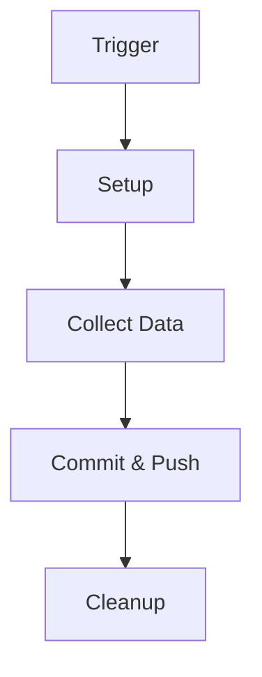

# 🚀 Jenkins Pipeline 프로젝트

<div align="center">
  
  
  
</div>

## 📋 프로젝트 개요

이 프로젝트는 Jenkins를 활용한 자동화된 데이터 수집 및 버전 관리 파이프라인을 구현합니다. 5분 간격으로 JSONPlaceholder API에서 데이터를 수집하여 Git 저장소에 자동으로 커밋하는 CI/CD 파이프라인을 제공합니다.

### ✨ 주요 기능

- ⏰ 5분마다 자동 실행되는 스케줄링
- 🔄 JSONPlaceholder API 데이터 자동 수집
- 📊 실시간 데이터 업데이트
- 🔒 자동화된 Git 버전 관리
- 📈 지속적인 통합 및 배포

## 🔧 파이프라인 아키텍처



### 1. 🛠️ Setup 단계
- 필수 도구 검증
  - curl 설치 확인
  - git 설치 확인
  - 버전 호환성 검사

### 2. 📥 Collect Data 단계
- 동적 API 엔드포인트 생성
  - 시간 기반 엔드포인트 계산
  - API 요청 최적화
- 데이터 수집 및 저장
  - JSON 형식 데이터 처리
  - 로컬 파일 시스템 저장

### 3. 🔄 Commit and Push 단계
- Git 워크플로우
  - 브랜치 관리
  - 자동 커밋
  - 원격 저장소 동기화

## 🛠️ 기술 스택

### 필수 구성 요소
- Jenkins Server
- Git
- curl
- Unix/Linux 환경

### 환경 변수
```bash
PATH=/usr/local/bin:/usr/bin:/bin
```

## ⚙️ 설정 가이드

### Git 설정
```bash
# Git 사용자 정보 설정
git config --global user.email "snoopyjch@gmail.com"
git config --global user.name "admin"
```

### Jenkins 설정
- SCM 폴링: `H/5 * * * *`
- 환경 변수: PATH 설정
- 워크스페이스 정리: 자동 활성화

## 🚨 오류 처리 및 모니터링

### 실패 시 디버깅 정보
```bash
# 시스템 정보
- 작업 디렉토리 상태
- 파일 시스템 구조
- Git 저장소 상태
- 브랜치 정보
- 원격 저장소 설정
```

### 로깅 레벨
- INFO: 일반 작업 로그
- WARNING: 경고 메시지
- ERROR: 오류 발생 정보
- DEBUG: 상세 디버깅 정보

## 📝 참고사항

### 보안 고려사항
- API 키 관리
- Git 자격 증명 보안
- 파일 시스템 접근 권한

### 성능 최적화
- 캐시 관리
- 리소스 사용량 모니터링
- 병렬 처리 최적화

### 유지보수
- 정기적인 로그 정리
- 시스템 상태 모니터링
- 백업 전략

---

<div align="center">
  <sub>Built with ❤️ by Jenkins Pipeline Team</sub>
</div>